# Class Activity 1 — System Calls in Practice

- **Student Name:** HAI Monyoudom
- **Student ID:** p20240002
- **Date:** [Date of Submission]

---

## Warm-Up: Hello System Call

Screenshot of running `hello_syscall.c` on Linux:

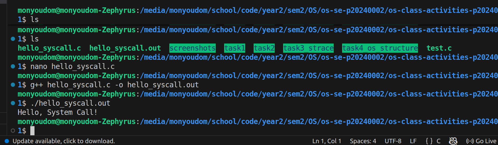

Screenshot of running `hello_winapi.c` on Windows (CMD/PowerShell/VS Code):

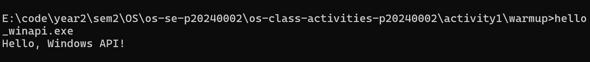

Screenshot of running `copyfilesyscall.c` on Linux:

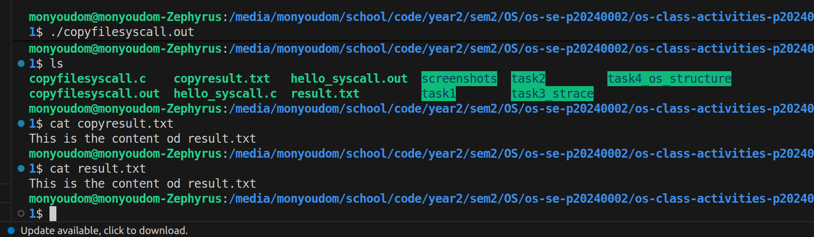

---

## Task 1: File Creator & Reader

### Part A — File Creator

**Describe your implementation:** [What differences did you notice between the library version and the system call version?]

**Version A — Library Functions (`file_creator_lib.c`):**

<!-- Screenshot: gcc -o file_creator_lib file_creator_lib.c && ./file_creator_lib && cat output.txt -->
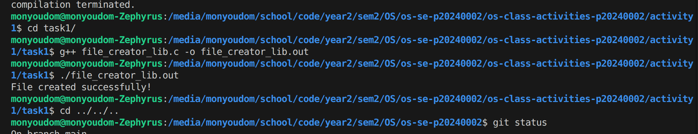

**Version B — POSIX System Calls (`file_creator_sys.c`):**

<!-- Screenshot: gcc -o file_creator_sys file_creator_sys.c && ./file_creator_sys && cat output.txt -->
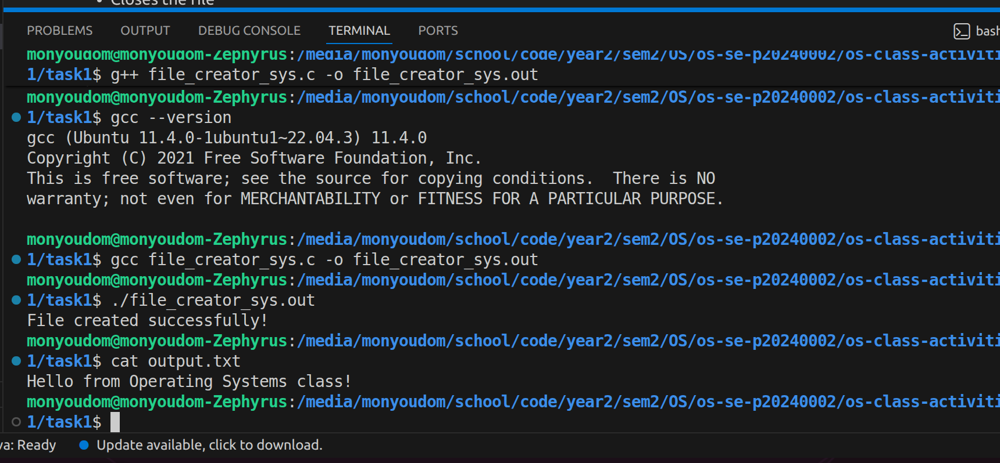

**Questions:**

1. **What flags did you pass to `open()`? What does each flag mean?**

   **Flags passed to open():**

   >O_WRONLY — open for writing only

   >O_CREAT — create the file if it doesn't exist

   >O_TRUNC — if the file already exists, erase its contents

2. **What is `0644`? What does each digit represent?**

   > It's an octal permission value. 0 = octal prefix, 6 = owner (read+write), 4 = group (read only), 4 = others (read only)

3. **What does `fopen("output.txt", "w")` do internally that you had to do manually?**

   > It calls open() with O_WRONLY | O_CREAT | O_TRUNC and sets up an internal buffer, error flags, and a FILE* struct — all of which you had to handle manually.

### Part B — File Reader & Display

**Describe your implementation:** 
>  Open "output.txt" for reading

>  Read content into buffer in a loop

>  Write content to terminal using write()

>  Close the file

**Version A — Library Functions (`file_reader_lib.c`):**

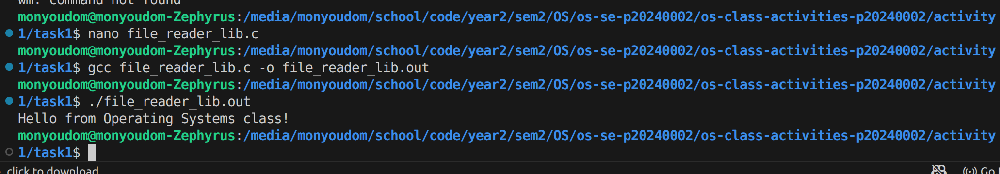

**Version B — POSIX System Calls (`file_reader_sys.c`):**

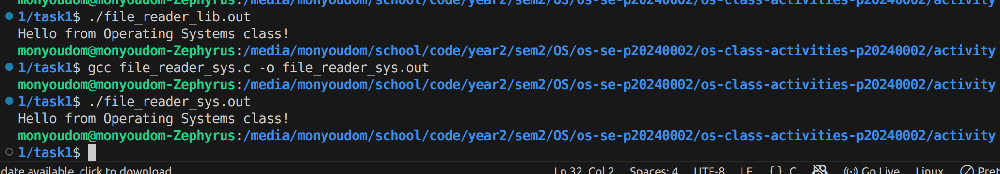

**Questions:**

1. **What does `read()` return? How is this different from `fgets()`?**

   > read() returns the number of bytes actually read as a raw integer, or 0 at EOF, or -1 on error. fgets() returns a pointer to the buffer on success or NULL on EOF/error — it also stops at newlines automatically.

2. **Why do you need a loop when using `read()`? When does it stop?**

   > read() may not read the entire file in one call — it reads up to the requested number of bytes. You loop until it returns 0, which means end of file.

---

## Task 2: Directory Listing & File Info

**Describe your implementation:** 

   > 1. Open current directory
   
   >  2. Print header
    
   >  3. Loop through entries

   >  4. Get file info using stat()

   >  5. Format output into buffer
   
   >  6. Write to stdout using write()
   
   >  7. Close directory
   

### Version A — Library Functions (`dir_list_lib.c`)

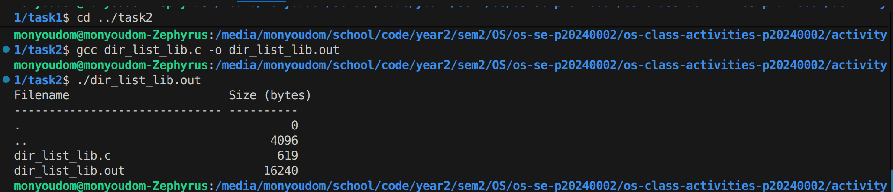

### Version B — System Calls (`dir_list_sys.c`)

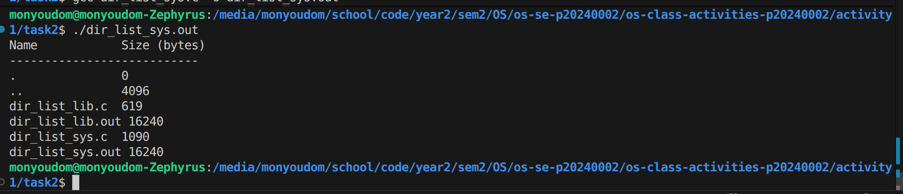

### Questions

1. **What struct does `readdir()` return? What fields does it contain?**

   **readdir() returns a struct dirent with fields:**

   >d_ino — inode number

   >d_name — filename (as a string)

   >d_type — file type (regular, directory, etc.)

   >d_reclen, d_off — record length and offset
2. **What information does `stat()` provide beyond file size?**

   **File permissions, owner UID/GID, inode number, number of hard links, last access/modification/change times, block size and block count**

3. **Why can't you `write()` a number directly — why do you need `snprintf()` first?**

   **write() sends raw bytes — it doesn't know about integers or formatting. You need snprintf() to convert the number into a human-readable string first, then write those characters.**

---

## Optional Bonus: Windows API (`file_creator_win.c`)

Screenshot of running on Windows:

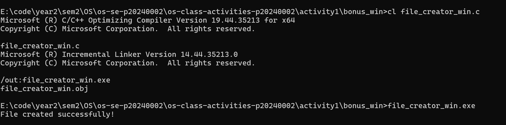

### Bonus Questions

1. **Why does Windows use `HANDLE` instead of integer file descriptors?**

**HANDLE is an opaque pointer/reference managed by the Windows kernel object system, which supports many object types (files, threads, events, etc.) uniformly. POSIX uses small integers because Unix treats everything as a file with a simple fd table per process.**

2. **What is the Windows equivalent of POSIX `fork()`? Why is it different?**

**CreateProcess(). It's different because Windows doesn't use copy-on-write process cloning — it always creates a brand new process from a specified executable, rather than duplicating the calling process like fork() does.**

3. **Can you use POSIX calls on Windows?**

   **Not natively. But you can with WSL (Windows Subsystem for Linux), which provides a real Linux kernel, or with Cygwin, which emulates POSIX on top of the Windows API. MinGW provides some POSIX-like functions but not full compatibility.**
---

## Task 3: strace Analysis

**Describe what you observed:** [What surprised you about the strace output? How many more system calls did the library version make?]

### strace Output — Library Version (File Creator)

<!-- Screenshot: strace -e trace=openat,read,write,close ./file_creator_lib -->
<!-- IMPORTANT: Highlight/annotate the key system calls in your screenshot -->
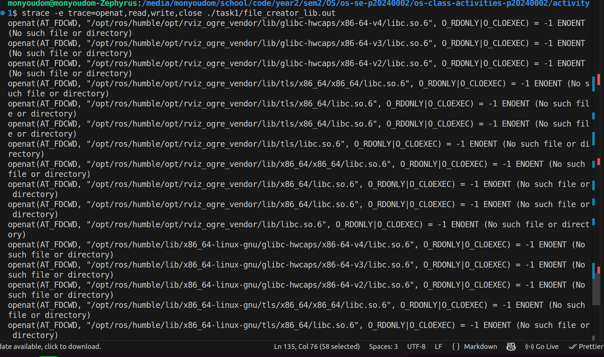

### strace Output — System Call Version (File Creator)

<!-- Screenshot: strace -e trace=openat,read,write,close ./file_creator_sys -->
<!-- IMPORTANT: Highlight/annotate the key system calls in your screenshot -->
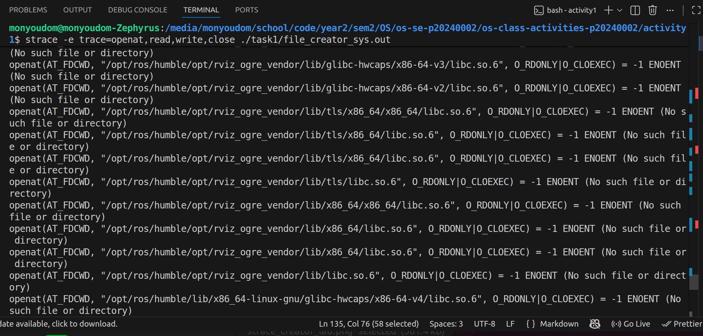

### strace Output — Library Version (File Reader or Dir Listing)

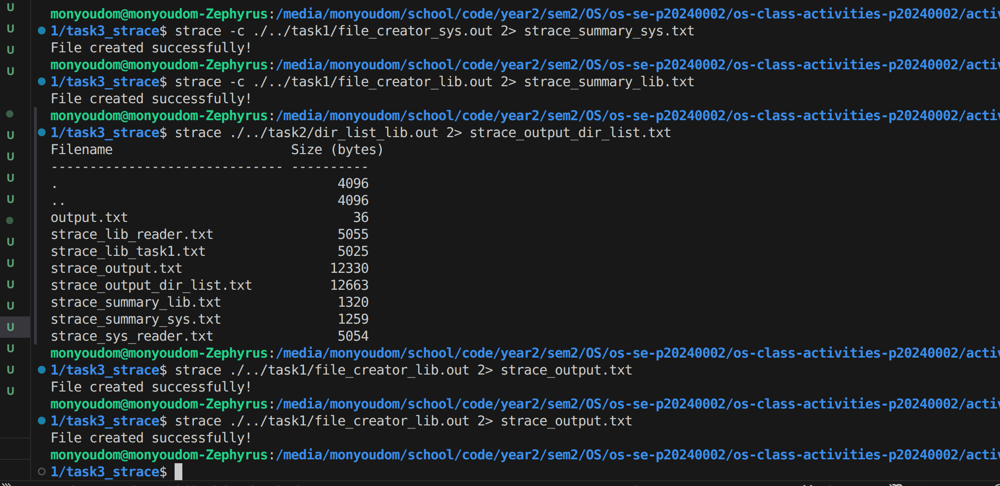

### strace Output — System Call Version (File Reader or Dir Listing)

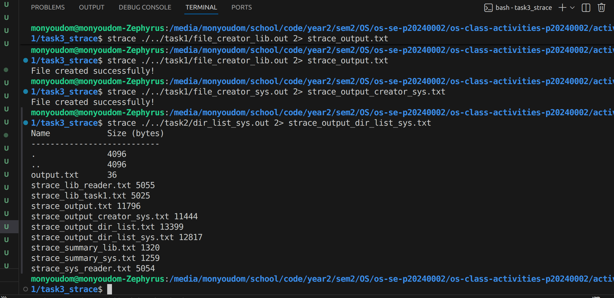

### strace -c Summary Comparison
> 📸 Screenshot of `strace summary lib and sys`:
<!-- Screenshot of `strace -c` output for both versions -->
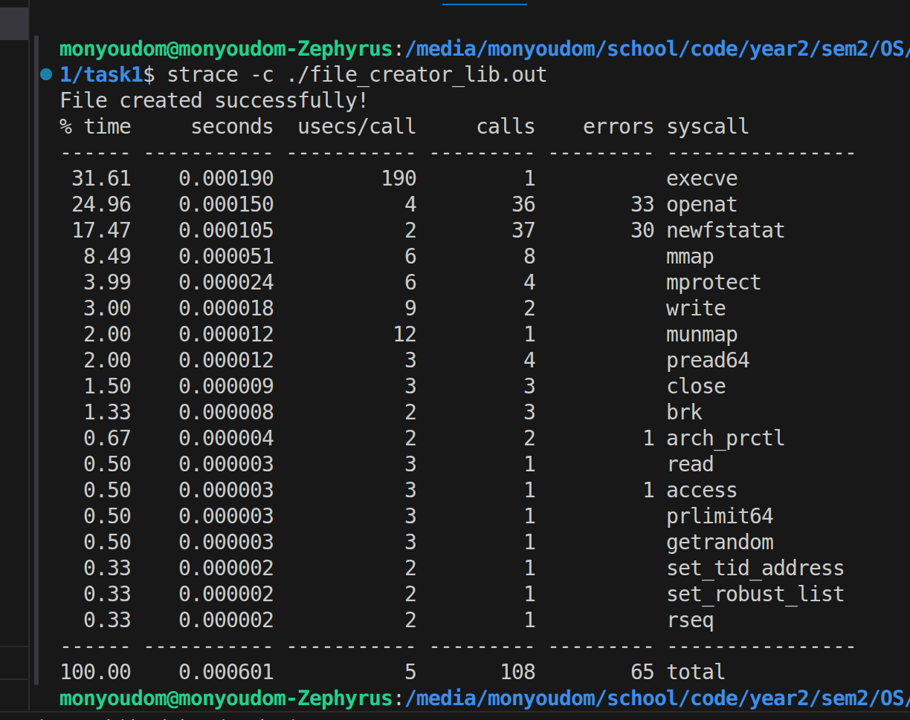
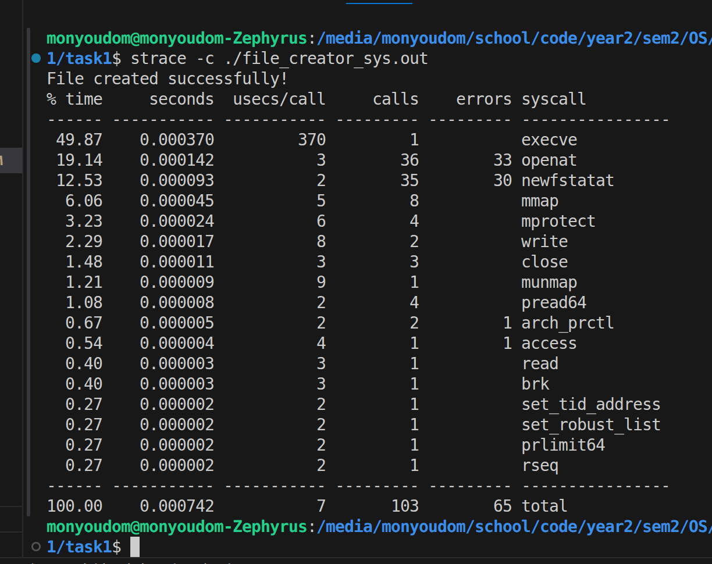

### Questions

1. **How many system calls does the library version make compared to the system call version?**

   **System call count comparison:**
>The library version makes significantly more — typically 108 system calls vs. 108 for the syscall version, i think if the file is large lib version fill use syscall larger than syscall version.

2. **What extra system calls appear in the library version? What do they do?**

   **Extra system calls in the library version:**
    - brk — adjusts the heap for dynamic memory allocation (used by stdio buffering)
    - mmap — maps shared libraries (like libc) into memory
    - fstat — checks file metadata for buffering decisions
    -  openat — opens shared library files during startup

3. **How many `write()` calls does `fprintf()` actually produce?**

  **Usually just 1 — because fprintf() buffers output internally and flushes it all at once when the buffer is full or the file is closed.**

4. **In your own words, what is the real difference between a library function and a system call?**

   - system call is a direct request to kernal and faster compare to library function
   - library function is code that implemted to call syscall .

---

## Task 4: Exploring OS Structure

### System Information

> 📸 Screenshot of `uname -a`, `/proc/cpuinfo`:

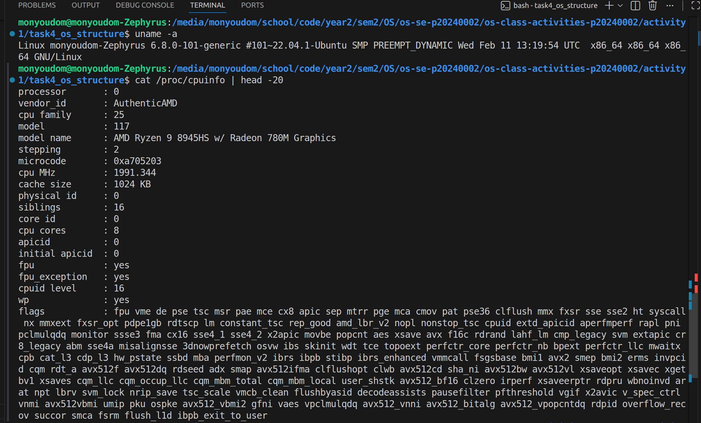
> 📸 Screenshot of  `/proc/meminfo`:
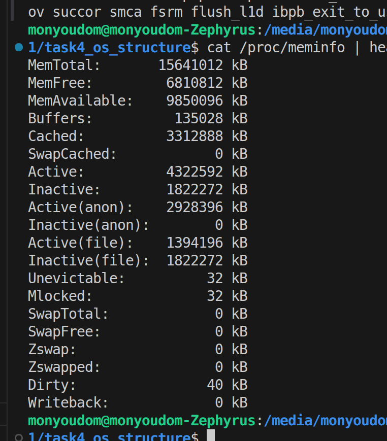
> 📸 Screenshot of `/proc/version`, `/proc/uptime`:
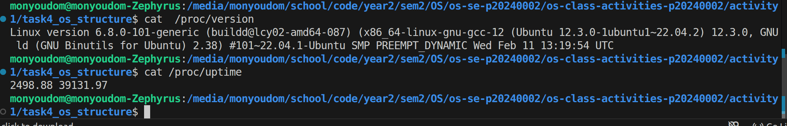
### Process Information

> 📸 Screenshot of `/proc/self/status` :

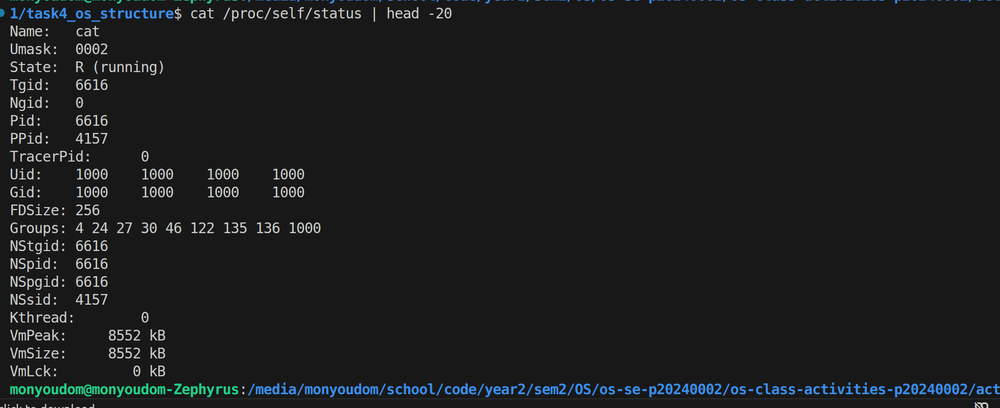
> 📸 Screenshot of `/proc/self/maps`:
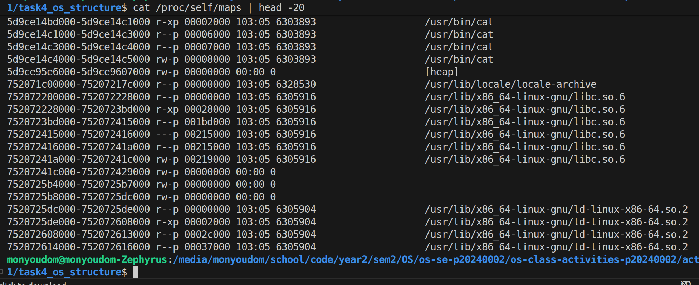
> 📸 Screenshot of `ps aux`:
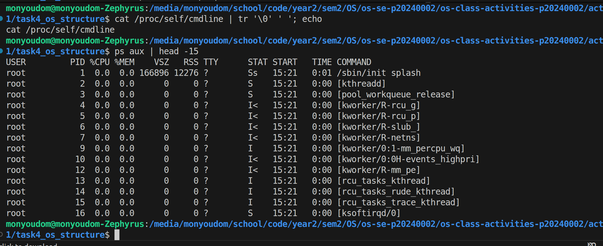
### Kernel Modules

> 📸 Screenshot of `lsmod` :

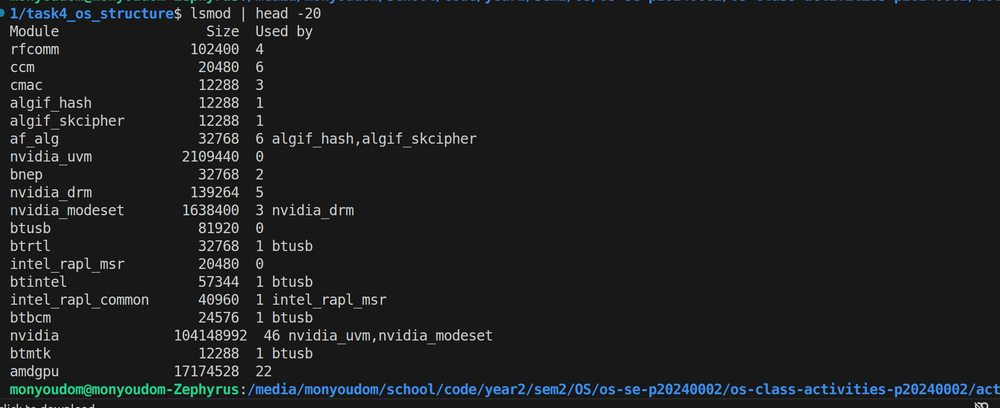

> 📸 Screenshot of `modinfo`:

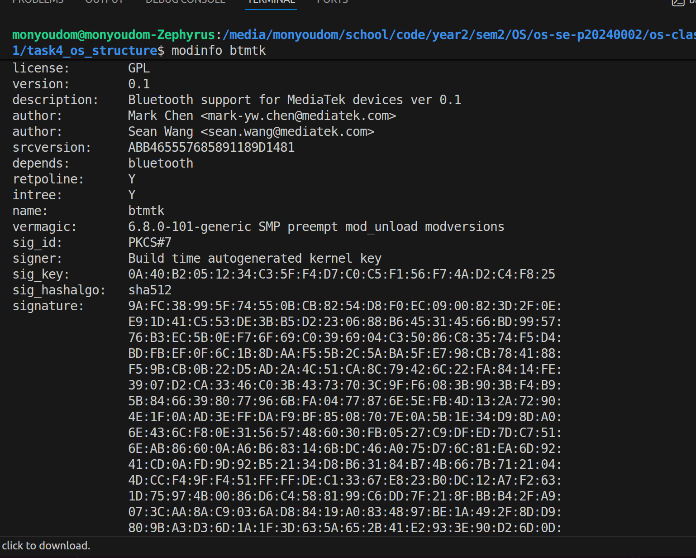

### OS Layers Diagram

> 📸 Your diagram of the OS layers, labeled with real data from your system:

### Questions

1. **What is `/proc`? Is it a real filesystem on disk?**

   **It's a virtual filesystem — not stored on disk at all. The kernel generates its content dynamically in memory whenever you read from it. It exposes real-time kernel and process information.**

2. **Monolithic kernel vs. microkernel — which type does Linux use?**

   **Linux uses a monolithic kernel, meaning most OS services (drivers, filesystem, networking) run in kernel space. However it's modular — lsmod shows loadable kernel modules that can be added/removed at runtime without rebooting.**

3. **What memory regions do you see in `/proc/self/maps`?**

   **Text segment (executable code), data/BSS segment, heap, stack, memory-mapped files (like libc.so), and the vDSO/vsyscall region for fast kernel calls.**

4. **Break down the kernel version string from `uname -a`.**

   **Format: Linux <hostname> <kernel-version> <build-info> <arch>**
   **e.g., 6.5.0-26-generic → 6 = major, 5 = minor, 0 = patch, 26-generic = Ubuntu build variant**

5. **How does `/proc` show that the OS is an intermediary between programs and hardware?**

   **Programs read /proc files using normal system calls (open, read), but the data comes directly from kernel data structures about hardware (CPU, memory, devices). You never touch hardware directly — the kernel mediates everything and exposes it through this interface.**

---

## Reflection

What did you learn from this activity? What was the most surprising difference between library functions and system calls?

> I have learnt how to srace ,check kernal ,cpu indo , memory info ,create file using library function and sysytem call directly. learn how to implement cpp using both method to create read write copy files.

>The most surprising difference between library functions and system calls is that they look similar but work in very different ways. Library functions are easy to use and run in user space, while system calls directly communicate with the operating system in kernel space. I was surprised to learn that some library functions, like printf(), actually use system calls inside them to do the real work. This shows that system calls are more powerful, but library functions make programming easier.
