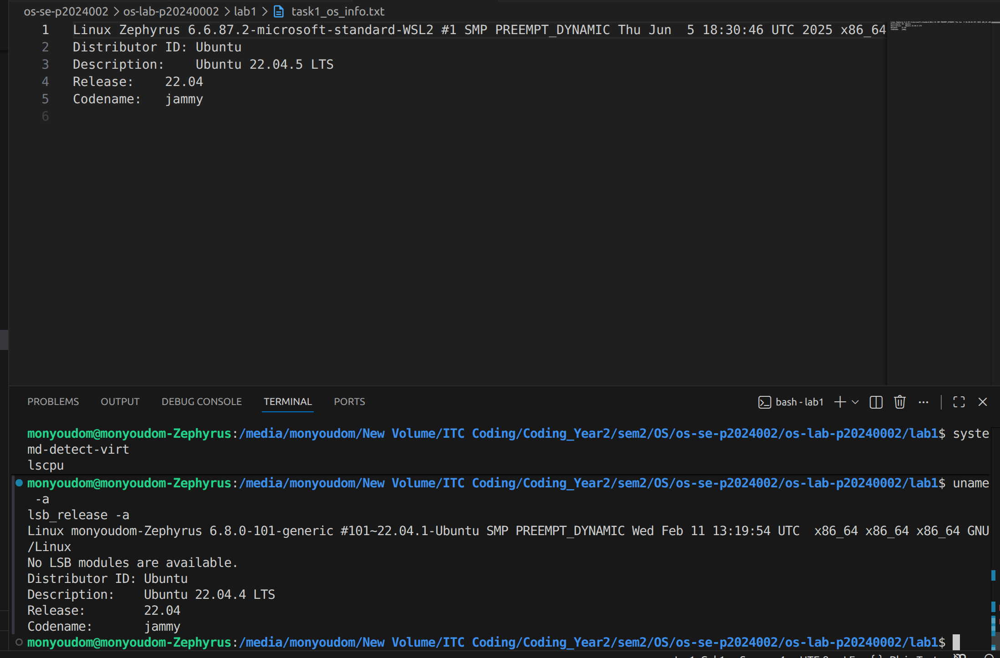
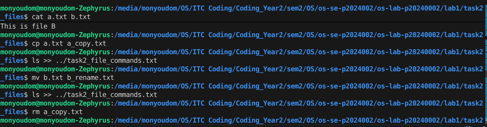
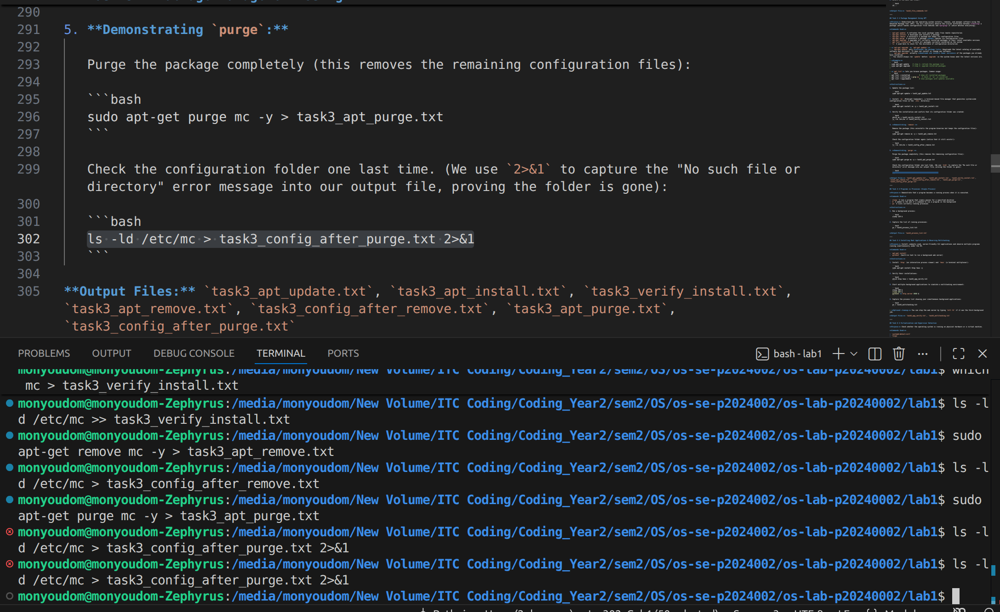
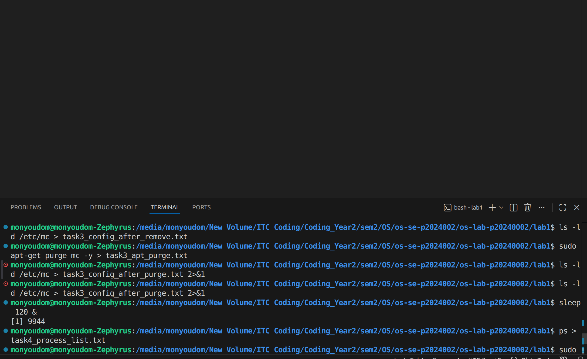
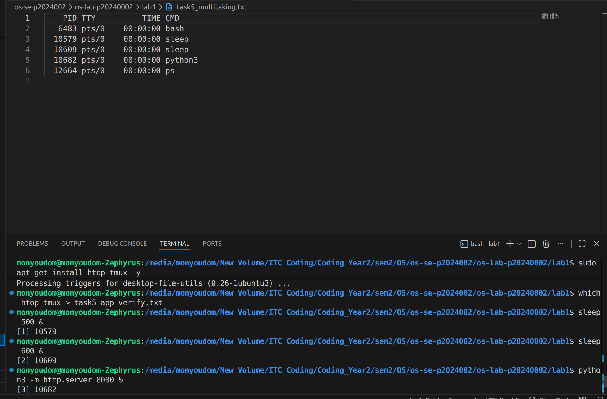
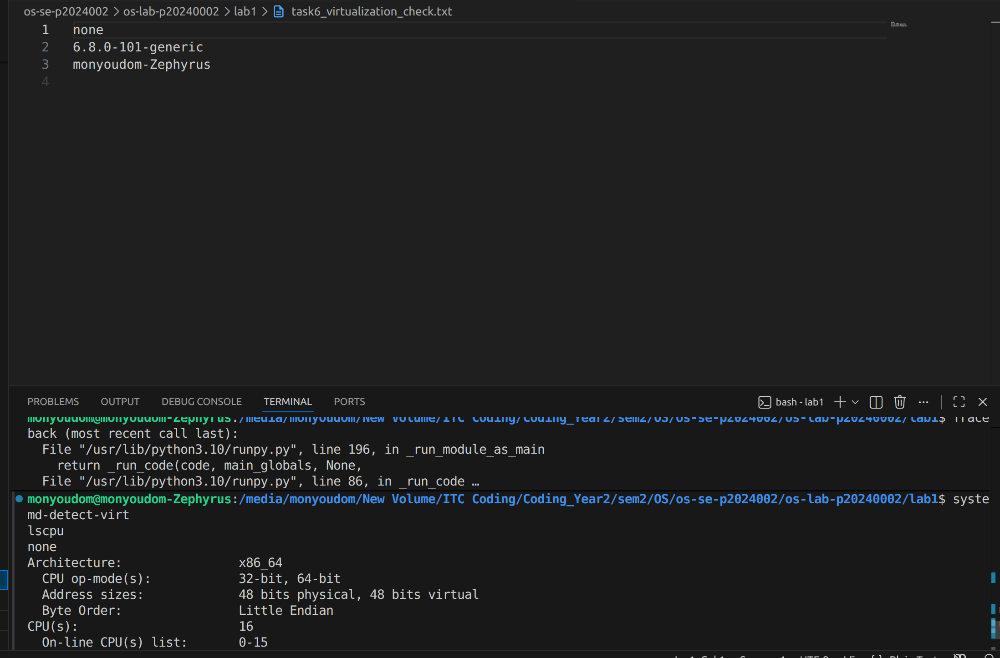

# OS Lab 1 Submission

- **Student Name:** HAI Monyoudom
- **Student ID:** p20240002
---

## Task 1: Operating System Identification

Briefly describe what you observed about your OS and Kernel here.

<!-- Insert your screenshot for Task 1 below: -->
<!-- SCREENSHOT REQUIREMENT: Show the terminal after running uname -a and lsb_release -a, or the contents of your task1_os_info.txt file. -->
why in the file task1 and my screenshot wrong becoz first i use wsl and now i use dual-boot ubuntu 
we can see kernal is after zephyrus 

---

## Task 2: Essential Linux File and Directory Commands

Briefly describe your experience creating, moving, and deleting files.
I using command such as :
 1.create file : touch file 
 2.create and write file : nano file
 3.moving file to other folder : mv file folder
 4.rename file " mv file new-name-file
 5.delete file :rm file
<!-- Insert your screenshot for Task 2 below: -->
<!-- SCREENSHOT REQUIREMENT: Show the terminal running the file manipulation commands (mkdir, touch, cp, mv, rm) or the final cat of your task2_file_commands.txt file. -->

---

## Task 3: Package Management Using APT

Explain the difference you observed between `remove` and `purge`.

remove : removes the installed program but keeps its configuration files
purge : removes the installed program and configuration files
<!-- Insert your screenshot for Task 3 below: -->
<!-- SCREENSHOT REQUIREMENT: Show the output of ls -ld /etc/mc after running apt-get remove (folder still exists) versus after running apt-get purge (folder is gone). -->

---

## Task 4: Programs vs Processes (Single Process)

Briefly describe how you ran a background process and found it in the process list.

after run sleep we can see by run command ps
<!-- Insert your screenshot for Task 4 below: -->
<!-- SCREENSHOT REQUIREMENT: Show the terminal where you ran sleep 120 & and the subsequent ps output showing the sleep process running. -->

---

## Task 5: Installing Real Applications & Observing Multitasking

Briefly describe the multitasking environment and the background web server.

we can see multitaking by sleep run 2 and once is python3 by using ps command
<!-- Insert your screenshot for Task 5 below: -->
<!-- SCREENSHOT REQUIREMENT: Show the terminal ps output capturing the multiple background tasks (sleep and python3 server) running at the same time. -->

---

## Task 6: Virtualization and Hypervisor Detection

State whether your system is running on a virtual machine or physical hardware based on the command outputs.

systemd-detect-virt detects if the system is running inside a virtual environment.
so for my case none which mean i using physical hardware which is dual-boot ubuntu

lscpu provides detailed information about the CPU architecture and virtualization support.
<!-- Insert your screenshot for Task 6 below: -->
<!-- SCREENSHOT REQUIREMENT: Show the terminal output of the systemd-detect-virt and lscpu commands. -->
