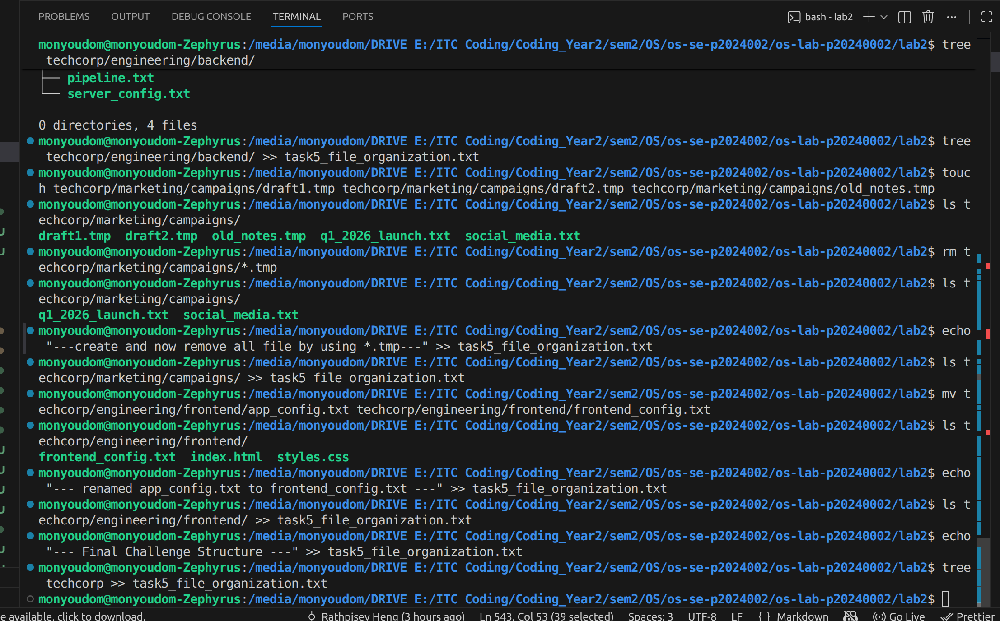
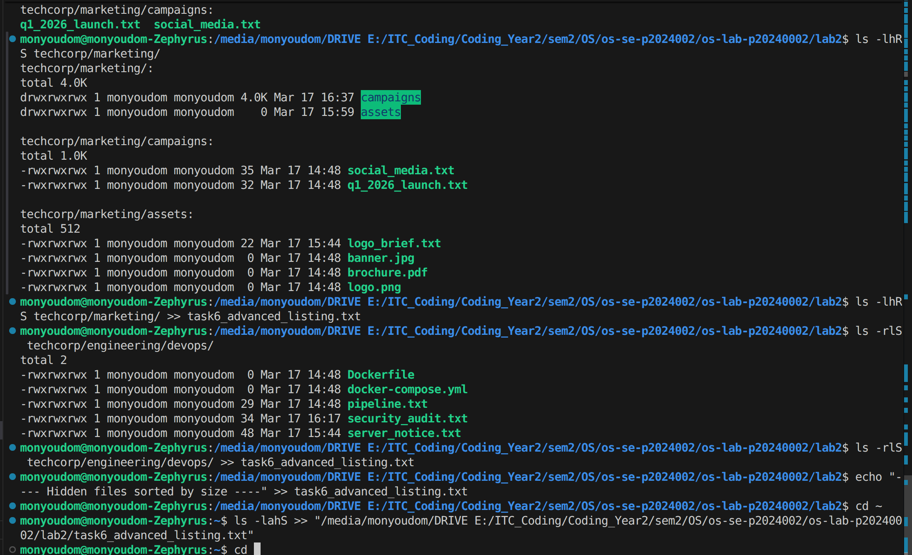

# OS Lab 2 Submission

- **Student Name:** HAI Monyoudom
- **Student ID:** p20240002
---

## Challenge 4 — Navigate on Your Own

Navigate directory by using cd absolute path or relatative 
using short like cd - for go back current directory that we work on 
or .. for up one level of directory

---

## Challenge 5  — Fix It Yourself

I move ,rename ,remove  ,copy file by using command rm , cp , mv 

---

##  Challenge 6  — Investigate on Your Own

using list to answer question based on different scenario.

