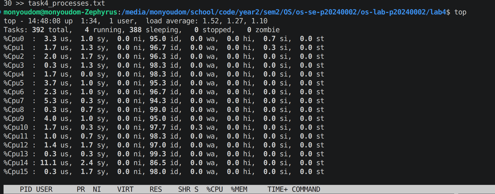
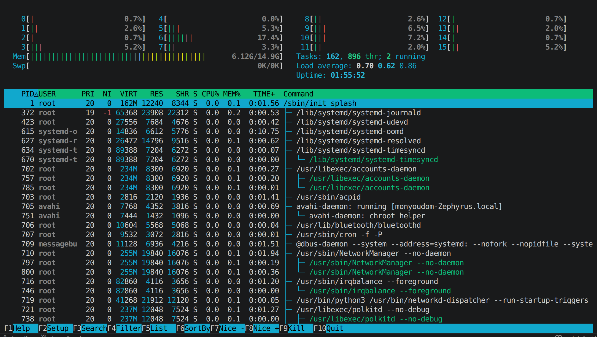
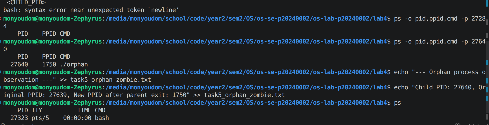
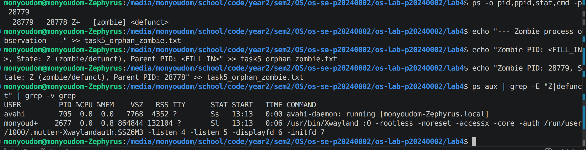
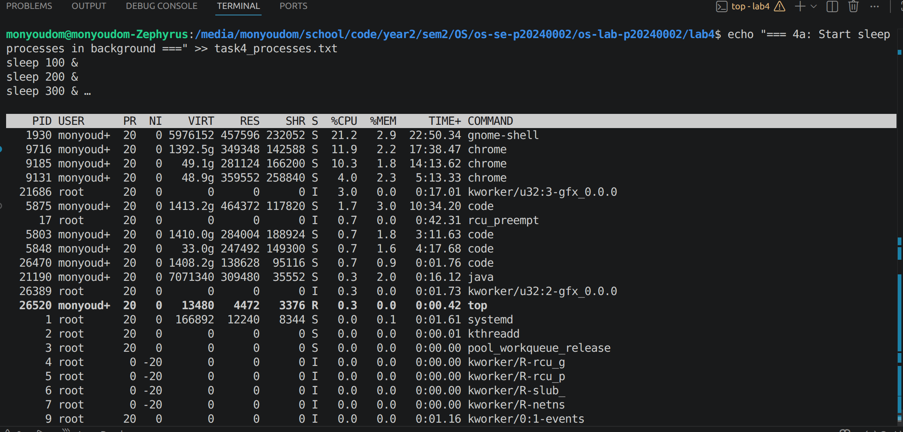
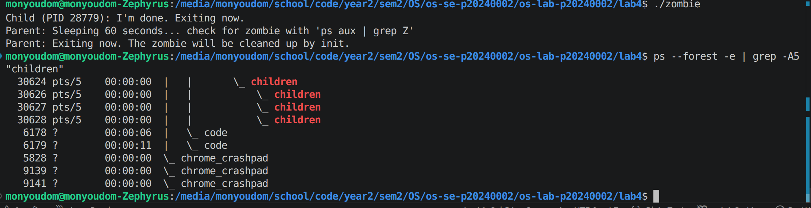
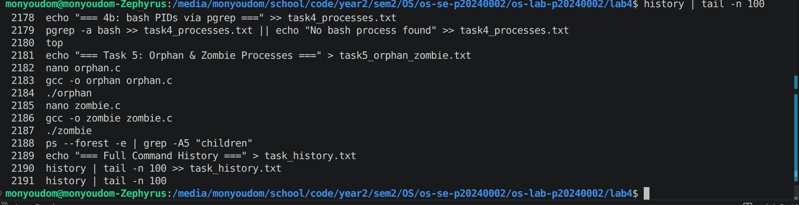

# OS Lab 4 Submission — I/O Redirection, Pipelines & Process Management

- **Student Name:** [Your Name Here]
- **Student ID:** [Your Student ID Here]

---

## Task Output Files

During the lab, each task redirected its output into `.txt` files. These files are your primary proof of work for the **guided portions** of each task. Make sure all of the following files are present in your `lab4/` folder:

- [ ] `task1_redirection.txt`
- [ ] `task2_pipelines.txt`
- [ ] `task3_analysis.txt`
- [ ] `task4_processes.txt`
- [ ] `task5_orphan_zombie.txt`
- [ ] `orphan.c`
- [ ] `zombie.c`
- [ ] `access.log`

---

## Screenshots

The screenshots below document the **interactive tools**, **process observations**, **challenge sections**, and **command history**.

---

### Screenshot 1 — Task 4: `top` Output

Show `top` running with the process list and column headers visible (PID, USER, %CPU, %MEM, COMMAND).

<!-- Insert your screenshot below: -->

---

### Screenshot 2 — Task 4: `htop` Tree View

Show `htop` in tree view (F5) displaying the process hierarchy with colored CPU/memory bars.

<!-- Insert your screenshot below: -->

---

### Screenshot 3 — Task 5: Orphan Process

Show the `ps` output proving the child process's PPID changed to 1 (or systemd PID) after the parent exited.

<!-- Insert your screenshot below: -->

---

### Screenshot 4 — Task 5: Zombie Process

Show the `ps` output with the zombie process visible — state `Z` or labeled `<defunct>`.

<!-- Insert your screenshot below: -->

---

### Screenshot 5 — Task 4 Challenge: Highest Memory Process

Show `top` sorted by memory usage with the top process identified.

<!-- Insert your screenshot below: -->

---

### Screenshot 6 — Task 5 Challenge: Process Tree with 3 Children

Show `ps --forest` output with the parent and 3 child processes visible.

<!-- Insert your screenshot below: -->

---

### Screenshot 7 — Command History

After finishing all tasks, run `history | tail -n 100` and take a screenshot.

<!-- Insert your screenshot below: -->

---

## Answers to Task 5 Questions

1. **How are orphans cleaned up?**
   > When a parent process dies before its child, the child becomes an orphan,Linux automatically gives it a new parent — PID 1 (init/systemd).init then cleans it up when it finishes.

2. **How are zombies cleaned up?**
   > A zombie is a child that finished but its parent never collected its exit status.The parent must call wait() to remove it from the process table.If the parent dies, init adopts and cleans it up automatically.

3. **Can you kill a zombie with `kill -9`? Why or why not?**
   > No. A zombie is already dead — it has no code running and uses no memory.kill -9 only works on running processes.The only fix is to kill the parent so init can clean it up.

---

## Reflection

> _What was the most useful command/technique you learned in this lab? How would you use pipelines and redirection in a real server environment?_

>The most useful thing I learned was using pipes ( | ) to chain commands together like grep, awk, and sort to filter and process output without creating extra files. In a real server, I would use pipelines to monitor logs in real time, ex: tail -f access.log | grep "403" to catch forbidden requests instantly. Redirection is also useful to save error logs separately using 2> so they don't mix with normal output.