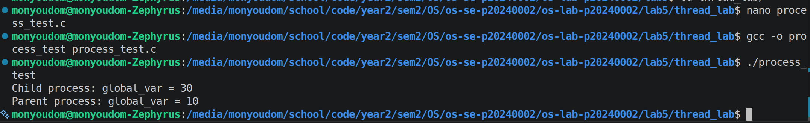
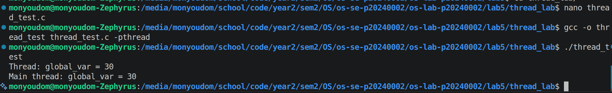
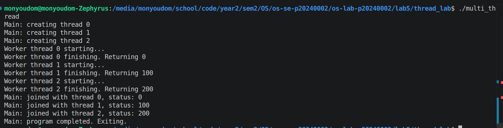
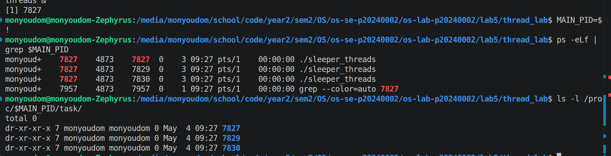
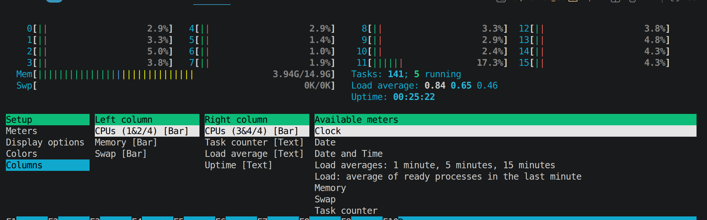
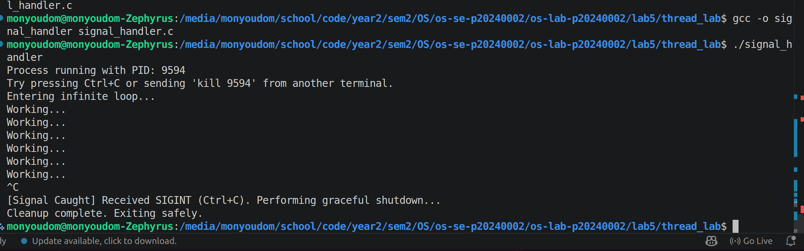
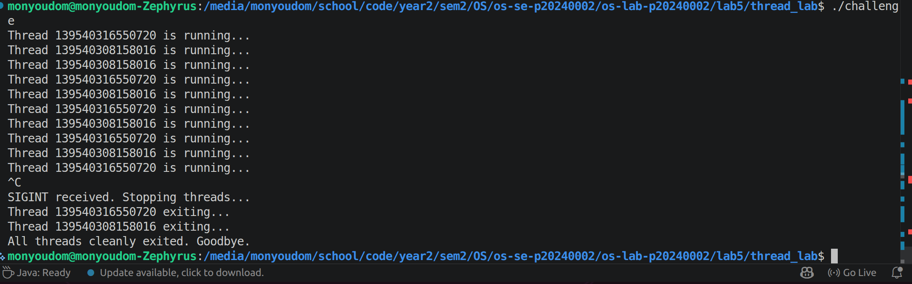

# OS Lab 5 Submission — Threads, Kernel Workers & Process Signals

- **Student Name:** HAI Monyoudom
- **Student ID:** p20240002

---

## Task Output Source Files

Make sure all of the following files are present in your `lab5/thread_lab/` folder:

- [ ] `process_test.c`
- [ ] `thread_test.c`
- [ ] `multi_thread.c`
- [ ] `sleeper_threads.c`
- [ ] `signal_handler.c`
- [ ] `challenge.c`

---

## Screenshots

Insert your screenshots below.

### Screenshot 1 — Task 1: Process vs Thread (Process Test)
Show the output of `process_test.c`.
<!-- Insert your screenshot below: -->

---

### Screenshot 2 — Task 1: Process vs Thread (Thread Test)
Show the output of `thread_test.c`.
<!-- Insert your screenshot below: -->

---

### Screenshot 3 — Task 2: Thread Interaction
Show the output of `multi_thread.c`.
<!-- Insert your screenshot below: -->

---

### Screenshot 4 — Task 3: Visualizing 1:1 Thread Mapping
Show the `ps -eLf` output or `/proc/[pid]/task/` directory visualizing the LWP mapping for user threads.
<!-- Insert your screenshot below: -->

---

### Screenshot 5 — Task 3: `htop` Kernel Threads
Show `htop` visualizing kernel threads (usually bracketed names like `[kworker]`).
<!-- Insert your screenshot below: -->

---

### Screenshot 6 — Task 4: Catching `SIGINT`
Show the output of your `signal_handler` program gracefully catching `Ctrl+C`.
<!-- Insert your screenshot below: -->

---

### Screenshot 7 — Challenge: Graceful Multithreaded Shutdown
Show the output of your `challenge.c` program joining its threads and exiting gracefully after receiving `Ctrl+C`.
<!-- Insert your screenshot below: -->

---

## Answers to Lab Questions

1. **Why do threads share memory while processes do not (by default)?**
   > Threads belong to the same process, so they use the same address space (same variables, heap, etc.). Processes are isolated from each other for safety, so each process has its own memory unless you explicitly use shared memory.

2. **Based on the 1:1 mapping, what is the role of an LWP (Lightweight Process) in Linux?**
   > An LWP is basically the kernel’s representation of a thread. Each user thread maps to one LWP, and the kernel schedules these LWPs to run on the CPU.

3. **Why is it restricted to send signals to kernel threads (e.g., `kthreadd` or `kworker`)?**
   > Kernel threads are part of the OS itself, not normal user programs. Allowing users to send signals to them could break the system or cause crashes, so Linux protects them.

4. **Why can't `SIGKILL` (kill -9) be caught by a signal handler?**
   > Because it’s designed to forcefully stop a process no matter what. If it could be caught or ignored, a process could refuse to die, which is dangerous for the system.

---

## Reflection

> _What was the most challenging part of managing threads and signals in this lab? How do you think these concepts apply to large-scale applications like web servers or databases?_

The hardest part was understanding how signals interact with threads, especially not stopping threads directly but using a shared flag. In real applications like web servers or databases, this is important for graceful shutdown, so they can finish tasks and release resources instead of crashing suddenly.